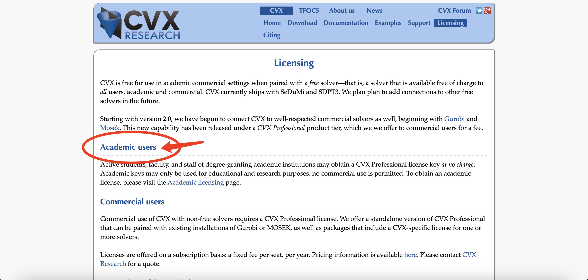

# Install cvx solver license

Go to the [official web page here](http://cvxr.com/cvx/licensing/), click **Acdemic users**

<figure><figcaption>
Licensing of cvx
</figcaption></figure>

In the new page, scroll down to the bottom to enter your infomation. Follow the instruction to enter the required info.

<figure><figcaption></figcaption></figure>

Several minutes later you will recieve an email like this:

<figure><figcaption>
Email with license
</figcaption></figure>

Follow the instruction in the email to install the license.
